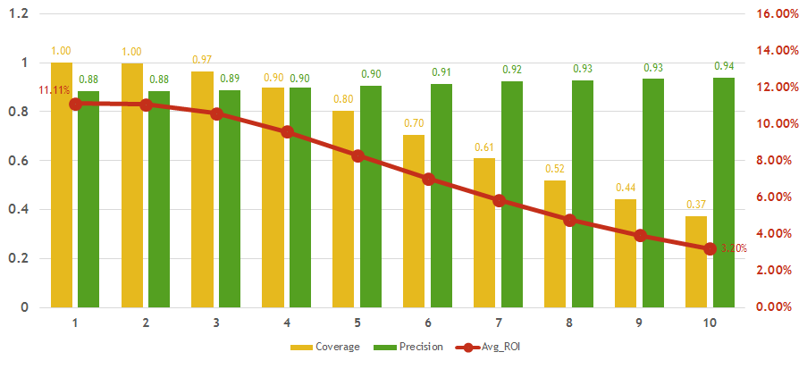

# BAD LOAN PREDICTION OF P2P LOANS
A Thinkful Capstone Project - using classification techniques such as logistic regressions and random forest to improve Lending Club's bad-loan prediction precision.

## PYTHON CODES
Check out the entired [python code](Capstone_project_script.py) for this project, or the [ipython notebook](Capstone_Project_Notebook.ipynb).

## PROJECT SUMMARY
This was my first data science project, and the project aims to accurately predict which loan is going to be good (paid out completely without delay) and which loan is going to be bad (default or payment is delayed).

The project analyzed the peer-to-peer loan data published by Lending Club from 2007 to 2013.  Combined with 3rd party demographic median income and urban influence data sets, the project performed classification using multiple logistic regression model as well as random forest on individual 3-year issued loans.

By reducing the model coverage, the project achieved a higher precision rate on predicting bad loans by 200 to 600 basis points from the average 88% paid-off rate; however, the project was not able to gain a higher return on investment due to lower interest rate are associated with safer loans.

## Future Steps
For future steps, the predictors such as FICO scores and debt-to-income (DTI) ratio can be excluded in order for the model to find safer loans with high returns.  In addition, interaction effects should also be analyzed.  Finally, I would like to find a small subset of observations (i.e. lower grades with high interest rate) that the model can improve prediction accuracy without sacrificing the ROI and/or coverage.
